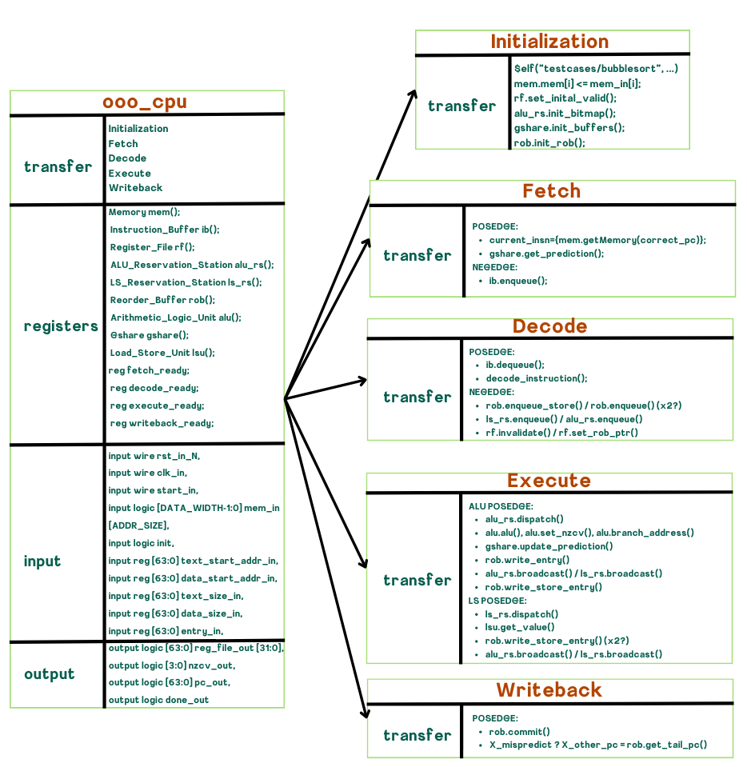
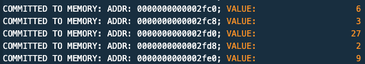
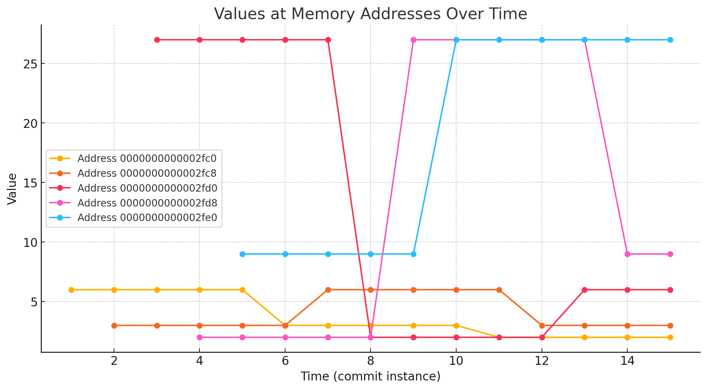

# Out Of Order CPU

Anoop Rachakonda, Pranav Budhwar, Sidaarth Sabhnani, Sridhar Nandigam, David Bockelman, Keolailani Rose


**To Run**
Choose the executable in the ooo_tb.sv, then cd into the src directory and run the following command:
        
```bash
$ make all
```

The results will be piped to src/logs folder and GTKWave will open up!

**Overview**



**Implementation**

- Reads on posedge, writes on negedge
- Every stage of the pipeline takes one cycle

**Initialization**

Inputs

- Input signals
    - input logic [DATA_WIDTH-1:0] mem_in [ADDR_SIZE],
    - input logic init
    - input reg [63:0] text_start_addr_in
    - input reg [63:0] data_start_addr_in
    - input reg [63:0] text_size_in
    - input reg [63:0] data_size_in
    - input reg [63:0] entry_in,
- ELF memory

Outputs

- Correct CPU memory

Logic

1. Copy the result of VPI call to $elf(executable, …) aka mem_in into the CPU’s memory that will be utilized via a segmented code and data segment

**Fetch**

Inputs

- pred_pc - predicted PC (either PC + 4 or PC + offset for branch) based off of past fetch instruction
- X_seq_succ_pc - if we are committing an instruction in the ROB to architectural state and it’s a mispredicted branch, need to set PC to this
- X_mispredict - send a flag if the branch was mispredicted (when committing from ROB)
- mem_in - physical memory to get instruction

Outputs

- Instruction Buffer entry
    - ib_seq_succ_pc - correct PC in case mispredicted branch
    - ib_insnbits - 32-bit ARM assembly instruction gotten from imem
    - ib_op - opcode gotten from top 11 bits of insnbits
    - ib_pc - PC from fetched instruction (need it for later stuff)

Logic

1. If we get a mispredicted branch signal, clear the entire instruction buffer and make size of buffer 0
2. check if instruction buffer is full - if it is, don’t fetch and stall because you can’t store outputs anywhere
3. figure out correct PC based on if there was a mispredicted branch and you have to correct PC, else use the gshare algorithm to predict
4. get current instruction insnbits using correct PC - call mem.getMemory function
5. figure out opcode using deocde_opcode function
6. if it’s an instruction where we branch based off an immediate (B cond, CBNZ, CBZ, B, BL), set pred_pc to PC + offset. Otherwise set to PC + 4
7. write to the instruction buffer and update instruction buffer head and size

**Decode**

Inputs

- Decoded instruction

Outputs

- Reorder buffer

Logic

1. Dequeue an instruction from the instruction buffer
2. Decode the instruction into a decode_outputs_t
3. If it is a L/S (tell via the D_M_sigs in the decode), add to load store reservation station and add a store buffer entry to the reorder buffer
4. Else, add to the ALU reservation station and add a normal entry to the reorder buffer
5. Invalidate register file and add the pointer to the reorder buffer
- Consider x2 for the pair instructions

**Execute**

Inputs

- Pull an execute record from the ALU reservation store or L/S reservation station (switch every cycle)

Outputs

- Updated reorder buffer value

Logic

1. If ALU posedge: Send a record from the ALU reservation station to the ALU else: 
2. Tell the ALU to compute
3. Update NZCV
4. Update gshare predictor
5. Update value in this instruction’s ROB entry
6. Consider x2 for the pair instructions

**Writeback**

Inputs

- N/A

Outputs

- X_mispredict
- X_other_pc (if X_mispredict)
- Commit to register file or memory

Logic

1. Commit tail
    1. If the program counter is modified, flush everything
    2. Else, write to the register file
    3. Reset tail entry and update pointer

**Structs**

```verilog
// INSTRUCTION BUFFER
typedef struct packed {
    logic [INSN_WIDTH-1:0] insn;
    opcodes_t op;
    logic [ADDR_WIDTH-1:0] other_pc;
    logic [ADDR_WIDTH-1:0] pc;
    logic prediction;
} ib_entry_t;

// DECODE
typedef struct packed {
    logic [$clog2(NUM_REGS)-1:0] reg_a_idx;
    logic [$clog2(NUM_REGS)-1:0] reg_b_idx;
    logic [$clog2(NUM_REGS)-1:0] reg_c_idx;
    logic [$clog2(NUM_REGS)-1:0] dest_reg_idx;
    logic [$clog2(NUM_REGS)-1:0] dest2_reg_idx;
    logic [63:0] val_imm;
    logic [3:0] cond;
    logic goto_alu_rs;
    logic [2:0] D_X_sigs;
    logic [2:0] D_M_sigs;
    logic [2:0] D_W_sigs;
    logic [5:0] hw;
} decode_outputs_t;

// REORDER BUFFER
typedef struct packed {
    logic [$clog2(NUM_REGS) - 1:0] dest_idx;
    logic [INSN_WIDTH - 1:0] instruction;
    logic [REG_SIZE - 1:0] dest_val;
    logic valid;
    logic [REG_SIZE - 1:0] nzcv_val;
    logic modified_nzcv;
    logic modified_pc;
    logic [63:0] pc_val;
    logic store;
    logic [ADDR_WIDTH - 1:0] addr;
    logic addr_valid;

} rob_entry_t;

// ALU RESERVATION STATION
typedef struct packed {
    logic valid;
    logic [3:0] res_cond;
    logic [$clog2(NUM_REGS) - 1:0] res_reg_a_idx;
    logic [REG_SIZE-1:0] res_val_a_value;

    logic [$clog2(NUM_REGS) - 1:0] res_reg_b_idx;
    logic [REG_SIZE-1:0] res_val_b_value;    
    logic res_val_b_is_imm;
    logic [MAX_IMM-1:0] res_val_imm;
    logic [5:0] res_val_hw;

    logic [INSN_WIDTH-1:0] res_insnbits;

    logic [REG_SIZE - 1:0] res_val_nzcv_value;

    logic [$clog2(ROB_SIZE)-1:0] res_dest_rob_ptr;

    opcodes_t res_op;
    logic [ADDR_WIDTH-1:0] res_other_pc;
    logic [ADDR_WIDTH-1:0] res_pc;
    logic res_prediction;
    logic [2:0] res_X_sigs;
    logic [2:0] res_M_sigs;
    logic [2:0] res_W_sigs;
} dispatch_outputs_t;

//L/S RESERVATION STATION
typedef struct packed {
    logic valid;
    logic [$clog2(NUM_REGS) - 1:0] ls_res_src_a_idx;
    logic [REG_SIZE-1:0] ls_res_src_a_value;
    logic ls_res_src_a_valid;
    logic [$clog2(ROB_SIZE)-1:0] ls_res_src_a_robPt;

    logic [$clog2(NUM_REGS) - 1:0] ls_res_src_b_idx;
    logic [REG_SIZE-1:0] ls_res_src_b_value;
    logic ls_res_src_b_valid;
    logic [$clog2(ROB_SIZE)-1:0] ls_res_src_b_robPt;

    logic [MAX_IMM-1:0] ls_res_offset;
    logic [$clog2(NUM_REGS) - 1:0] ls_res_addr_idx;
    logic [REG_SIZE-1:0] ls_res_addr_value;
    logic ls_res_addr_valid;
    logic [$clog2(ROB_SIZE)-1:0] ls_res_addr_robPt;

    logic [$clog2(NUM_REGS) - 1:0] ls_res_dest_a_idx;
    logic les_res_dest_a_mod;

    logic [$clog2(NUM_REGS) - 1:0] ls_res_dest_b_idx;
    logic  les_res_dest_b_mod;

    logic [INSN_WIDTH-1:0] ls_res_insnbits;
    opcodes_t ls_res_op;
    logic [$clog2(ROB_SIZE)-1:0] ls_res_dest_rob_ptr;

    // [2] if pair
    // [1] 1 if memory access is a read, 0 if not. load
    // [0] 1 if memory access is a write, 0 if not. store
    logic [2:0] ls_res_M_sigs;

    // [2] dst selector: 1 for X30 (in BL), 0 otherwise.
    // [1] wval selector: 1 for LDUR, 0 otherwise.
    // [0] Whether to perform a write: 0 for no, 1 for yes.
    logic [2:0] ls_res_W_sigs;

} ls_dispatch_outputs_t;

```

**Programs**

**Popcount**

```nasm
.arch armv8-a
.global main
.text
main:                                   // @main
        sub     sp, sp, #16             // =16
        movz    x8, #48879
        movk    x8, #65261, lsl #16
        movk    x8, #57005, lsl #32
        movk    x8, #64206, lsl #48

        movz    x9, #0x5555             // 0x5555555555555555
        movk    x9, #0x5555, lsl #16
        movk    x9, #0x5555, lsl #32
        movk    x9, #0x5555, lsl #48

        movz    x10, #0x3333             // 0x3333333333333333
        movk    x10, #0x3333, lsl #16
        movk    x10, #0x3333, lsl #32
        movk    x10, #0x3333, lsl #48

        movz    x11, #0x0f0f             // 0x0f0f0f0f0f0f0f0f
        movk    x11, #0x0f0f, lsl #16
        movk    x11, #0x0f0f, lsl #32
        movk    x11, #0x0f0f, lsl #48

        movz    x12, #0x00ff             // 0x00ff00ff00ff00ff
        movk    x12, #0x00ff, lsl #16
        movk    x12, #0x00ff, lsl #32
        movk    x12, #0x00ff, lsl #48

        movz     x13, #0xffff             // 0x0000ffff0000ffff
        movk     x13, #0xffff, lsl #32

        movz     x14, #0xffff             // 0x00000000ffffffff
        movk     x15, #0xffff, lsl #16

        // movz     x10, #3689348814741910323
        // movz     x11, #1085102592571150095
        // movz     x12, #71777214294589695
        // movz     x13, #281470681808895
        // movz     x14, #4294967295

        stur     xzr, [sp, #12]
        stur     x8, [sp]
        ldur     x8, [sp]
        ands     x8, x8, x9
        ldur     x15, [sp]
        lsr     x15, x15, #1
        ands     x9, x15, x9
        adds     x8, x8, x9
        stur     x8, [sp]
        ldur     x8, [sp]
        ands     x8, x8, x10
        ldur     x9, [sp]
        lsr     x9, x9, #2
        ands     x9, x9, x10
        adds     x8, x8, x9
        stur     x8, [sp]
        ldur     x8, [sp]
        ands     x8, x8, x11
        ldur     x9, [sp]
        lsr     x9, x9, #4
        ands     x9, x9, x11
        adds     x8, x8, x9
        stur     x8, [sp]
        ldur     x8, [sp]
        ands     x8, x8, x12
        ldur     x9, [sp]
        lsr     x9, x9, #8
        ands     x9, x9, x12
        adds     x8, x8, x9
        stur     x8, [sp]
        ldur     x8, [sp]
        ands     x8, x8, x13
        ldur     x9, [sp]
        lsr     x9, x9, #16
        ands     x9, x9, x13
        adds     x8, x8, x9
        stur     x8, [sp]
        ldur     x8, [sp]
        ands     x8, x8, x14
        ldur     x9, [sp]
        lsr     x9, x9, #32
        ands     x9, x9, x14
        adds     x8, x8, x9
        stur     x8, [sp]
        ldur     x8, [sp]
        //mov     x0, x8
        add     sp, sp, #16             // =16
        ret

```

0xFACEDEADFEEDBEEF


**Bubble sort**

```nasm
.arch armv8-a
.global main
.text

bubbleSort:                             // @bubbleSort
        sub     sp, sp, #48
        stur     x0, [sp, #40]
        stur     x1, [sp, #32]
        stur     xzr, [sp, #24]
        b       .LBB0_1
.LBB0_1:                                // =>This Loop Header: Depth=1
        ldur     x8, [sp, #24]
        ldur     x9, [sp, #32]
        sub     x9, x9, #1
        subs    x8, x8, x9
        b.ge    .LBB0_10
        b       .LBB0_2
.LBB0_2:                                //   in Loop: Header=BB0_1 Depth=1
        stur     xzr, [sp, #16]
        b       .LBB0_3
.LBB0_3:                                //   Parent Loop BB0_1 Depth=1
        ldur     x8, [sp, #16]
        ldur     x9, [sp, #32]
        ldur     x10, [sp, #24]
        subs    x9, x9, x10
        sub    x9, x9, #1
        subs    x8, x8, x9
        b.ge    .LBB0_8
        b       .LBB0_4
.LBB0_4:                                //   in Loop: Header=BB0_3 Depth=2
        ldur     x8, [sp, #40]
        ldur     x9, [sp, #16]
        lsl     x9, x9, #3
        adds     x10, x8, x9
        ldur     x8, [x10]
        ldur     x9, [sp, #40]
        ldur     x10, [sp, #16]
        add     x10, x10, #1
        lsl     x10, x10, #3
        adds     x11, x9, x10
        ldur     x9, [x11]
        subs    x8, x8, x9
        b.le    .LBB0_6
        b       .LBB0_5
.LBB0_5:                                //   in Loop: Header=BB0_3 Depth=2
        ldur     x8, [sp, #40]
        ldur     x9, [sp, #16]
        lsl     x9, x9, #3
        adds     x10, x8, x9
        ldur     x8, [x10]
        stur     x8, [sp, #8]
        ldur     x8, [sp, #40]
        ldur     x9, [sp, #16]
        add     x9, x9, #1
        lsl     x9, x9, #3
        adds     x10, x8, x9
        ldur     x8, [x10]
        ldur     x9, [sp, #40]
        ldur     x10, [sp, #16]
        lsl     x10, x10, #3
        adds     x11, x9, x10
        stur     x8, [x11]
        ldur     x8, [sp, #8]
        ldur     x9, [sp, #40]
        ldur     x10, [sp, #16]
        add     x10, x10, #1
        lsl     x10, x10, #3
        adds     x11, x9, x10
        stur     x8, [x11]
        b       .LBB0_6
.LBB0_6:                                //   in Loop: Header=BB0_3 Depth=2
        b       .LBB0_7
.LBB0_7:                                //   in Loop: Header=BB0_3 Depth=2
        ldur     x8, [sp, #16]
        add     x8, x8, #1
        stur     x8, [sp, #16]
        b       .LBB0_3
.LBB0_8:                                //   in Loop: Header=BB0_1 Depth=1
        b       .LBB0_9
.LBB0_9:                                //   in Loop: Header=BB0_1 Depth=1
        ldur     x8, [sp, #24]
        add     x8, x8, #1
        stur     x8, [sp, #24]
        b       .LBB0_1
.LBB0_10:
        add     sp, sp, #48
        ret
main:                                   // @main
        sub     sp, sp, #80
        stp     x29, x30, [sp, #64]             // 16-byte Folded Spill
        add     x29, sp, #64
        movz     x8, #0
        stur     x8, [sp, #12]                   // 4-byte Folded Spill
        stur    xzr, [x29, #-4]
        add     x0, sp, #16
        movz     x1, #5                         // ARRAY SIZE
        movz     x8, #6                         // =0x5 ARRAY VALS
        stur     x8, [sp, #16]
        movz     x8, #3                          // =0x4
        stur     x8, [sp, #24]
        movz     x8, #27                          // =0x3
        stur     x8, [sp, #32]
        movz     x8, #2                          // =0x2
        stur     x8, [sp, #40]
        movz     x8, #9                          // =0x1
        stur     x8, [sp, #48]
        bl      bubbleSort
        ldur     x0, [sp, #12]                   // 4-byte Folded Reload
        ldp     x29, x30, [sp, #64]             // 16-byte Folded Reload
        add     sp, sp, #80
        ret
```



